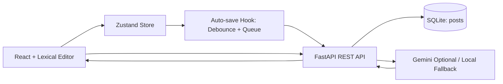

# Architecture

## System Diagram

## High-Level Design
- Frontend owns editing experience, interaction model, and optimistic state.
- Backend owns persistence, schema evolution, and AI response streaming.
- SQLite persists canonical post records and metadata.

## Frontend LLD

### `src/store/useEditorStore.js`
- Single source of truth for:
  - editor JSON state
  - plain text
  - drafts list
  - save/publish flags
  - AI generation state
- Provides side-effect actions (`initialize`, `selectDraft`, `persistSnapshot`, `publishCurrentPost`, `generateAI`).

### `src/hooks/undebounceSave.js`
- Custom debounced queue-based auto-save algorithm.
- Debounce controls request frequency.
- Queue ensures latest state is eventually persisted even with in-flight requests.

### `src/components/Editor/MyEditor.jsx`
- Lexical setup with heading/list nodes.
- `OnChangePlugin` serializes editor state to JSON + plain text.
- Updates Zustand only; save transport stays in hook/store.

### `src/components/Editor/Toolbar.jsx`
- Formatting controls:
  - bold, italic
  - H1, H2, paragraph
  - ordered and unordered lists
- AI controls:
  - summary
  - grammar fix
- Shows streamed AI output panel.

### `src/components/DraftSidebar.jsx`
- Lists drafts globally from Zustand.
- Supports quick switching and new-draft creation.

### `src/components/EditorHeader.jsx`
- Save/publish UX and status indicators.

## Backend HLD/LLD

### `src/backend/main.py`
- FastAPI app with CORS.
- SQLite schema initializer + lightweight migration logic.
- REST endpoints for create/update/list/get/publish posts.
- AI endpoint:
  - tries Gemini when `GEMINI_API_KEY` exists
  - falls back to local summary/grammar transform
  - streams chunks via SSE.

## Data Model
Table `posts`:
- `id INTEGER PRIMARY KEY`
- `title TEXT`
- `content_json TEXT` (serialized Lexical JSON)
- `content_text TEXT` (plain text)
- `status TEXT` (`draft`/`published`)
- `created_at TEXT` (ISO-8601 UTC)
- `updated_at TEXT` (ISO-8601 UTC)

## Why This Structure
- Clear separation of concerns:
  - components render UI
  - store owns domain state
  - hook owns autosave algorithm
  - API module isolates HTTP details
- Easy extension path for auth, tags, collaborative editing, and analytics.
